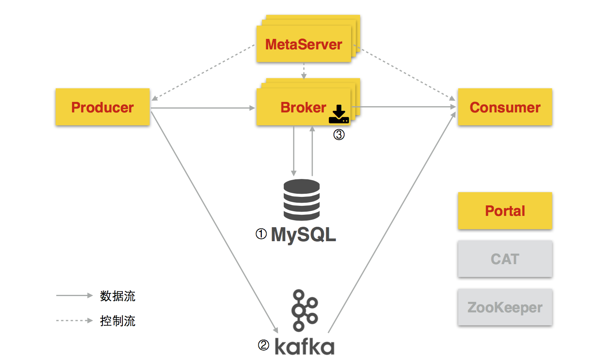
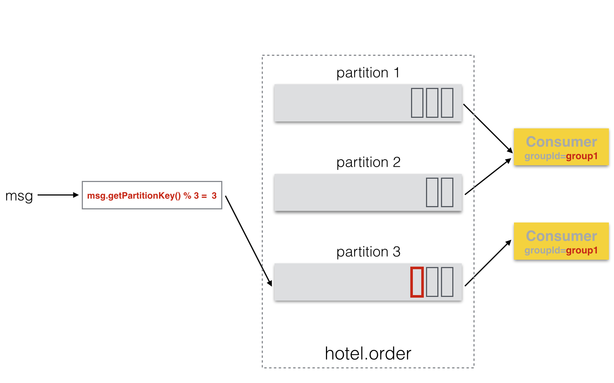
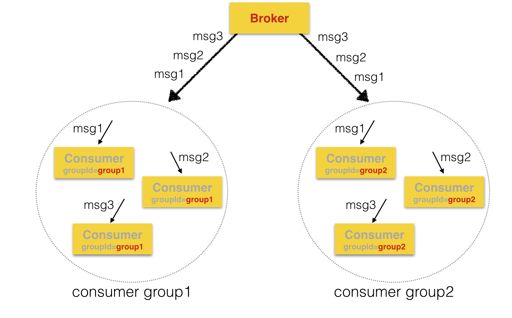

# Hermes是什么
一个高可用、高吞吐、适合各种应用场景的消息队列。

# Why another消息队列
* 简单、统一--One API解决各种业务场景
* 完善的监控--消息如何在系统中流转，用户可以一目了然
* 高可用、高吞吐、高性能

# 整体架构

## 消息发送
消息由Producer(生产者)创建，然后发送到Broker(消息服务器)，Broker根据消息所属Topic的配置信息确定消息的存储，将消息保存到相应的存储。

## 消息接收
Consumer(消费者)向Broker订阅Topic，然后Broker将Topic对应的消息投递到Consumer进行处理。

## 消息管理
Portal是用户管理消息的站点，用户可以在Portal申请Topic、消费者分组，查看消息的整个流转情况，进行消息的自助管理等。

## 三种存储
* MySQL--适用于消息量中等及以下，对消息治理有较高要求的场景
* Kafka--适用于消息量大的场景
* Broker分布式文件存储--用于替换Kafka，开发中

# 性能

# API
## Producer
```java    
Producer p = Producer.getInstance();
Order order = new Order(...);
p.message("hotel.order", order.getId(), order).send();
```
## Consumer
```java
Consumer c = Consumer.getInstance();
String groupId = "group1";

// start a non-batch consumer
c.start("hotel.order", groupId, new BaseMessageListener<Order>(groupId) {
	@Override
	public void onMessage(ConsumerMessage<Order> msg) {
		Order order = msg.getBody();
		// process the order
	}
});

// start a batch consumer
c.start("hotel.order", "groupId", new MessageListener<Order>() {
	@Override
	public void onMessage(List<ConsumerMessage<Order>> msgs) {
		// batch process orders
	}
});
```

# 消息分区

消息分区用于保证消息的消费顺序，同一个分区内的消息会按发送顺序依次投递给消费者，不同分区内的消息不保证按发送顺序投递。因此，如果消息之间需要确保消费顺序，请确保这些消息的分区键(partition key)相同。

```java
p.message("hotel.order", "partition key1", msg1).send();
p.message("hotel.order", "partition key1", msg2).send();
```

同时，在有序消费模式下，消息分区的数量决定了同一消费者分组内消费者数量的上限，对于一个消费者分组，一个分区只允许一个消费者消费，因为只有这样才能确保一个分区按顺序消费，因此：

```
消费者数量(一个消费者分组内) <= 分区数量
```

# 消息者分组

消费者分组用于控制消息分发的语义，一个消费者分组由若干设置了相同groupId的消费者组成。Broker在分发消息时，会将每一条消息分发到所有的消费者分组，然后在每一个消费者分组内选择一个消费者进行投递。即每一个消费者分组都能消费到完整的消息流，互不影响。而同一消费者分组内的消费者“竞争”消费消息，每一条消息只会被消费一次。

# 消息重新投递
消费者在处理消息时如果调用了消息的nack()方法，则Broker会在设定的时间后重新投递该消息给消费者进行再一次处理，当达到设定的重新投递次数上限后将不再重新投递，而保存到系统的死信(dead letter)存储中，用户可以在Portal查看或者设置将死信消息重新投递。

```java
new BaseMessageListener<Order>(groupId) {
	@Override
	public void onMessage(ConsumerMessage<Order> msg) {
		msg.nack();
	}
}
```

如果消费者在处理消息(onMessage)时抛出异常，不会重新投递该消息，因此，在处理消息时请使用try-catch-finally捕获异常，并根据具体情况决定是否调用nack()来重新投递消息。

# 消息标识和查询
Producer在发送消息时可以为每一条消息设定一个唯一标识该消息的ref key，通过ref key，用户可以在Portal查找该消息，并查看该消息的发送、投递、处理、重发等各个环节的详细信息。

```java
Producer p = Producer.getInstance();
String orderId = order.getId();
p.message(...).withRefKey(orderId).send();
```

ref key一般使用具有业务含义又在Topic内部具有唯一性的字符串，如订单号等。

# 批量订阅
如果需要订阅多个Topic的消息进行统一处理，可以通过批量订阅的方式。

```java
Consumer c = Consumer.getInstance();
String groupId = "group1";

// start a non-batch consumer
c.start("hotel.order", groupId, new BaseMessageListener<Order>(groupId) {
	@Override
	public void onMessage(ConsumerMessage<Order> msg) {
		Order order = msg.getBody();
		// process the order
	}
});
```

# 消息重新消费/放弃消费

# 消息过滤

# Topic命名规范

# FAQ 
* 会不会丢消息